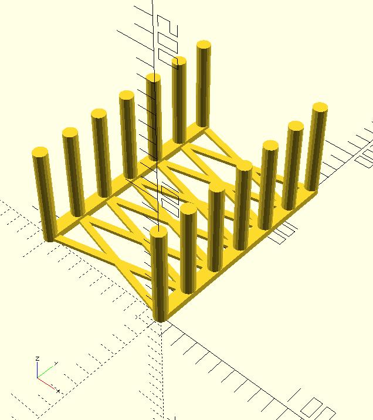
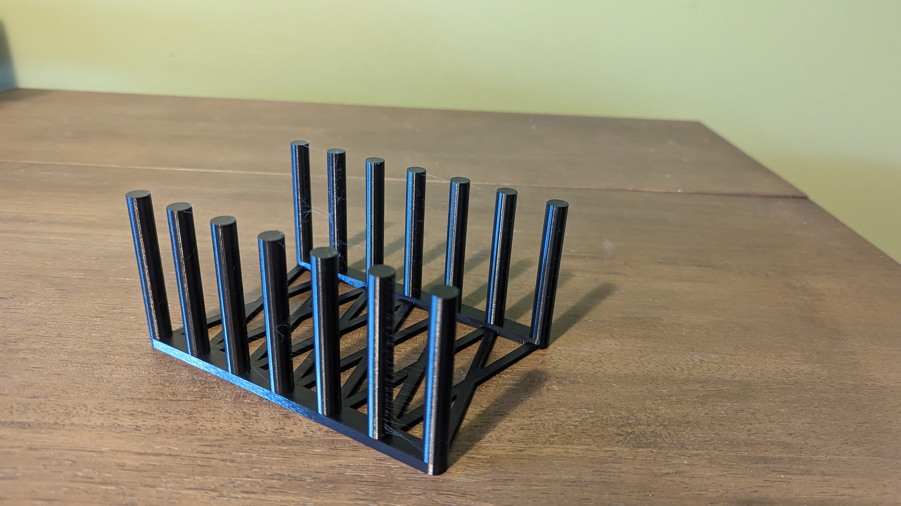

# IKEA 365 Lid Storage
Organizer to store the plastic lids for the IKEA 365 food storage containers vertically so they are both easy to access and stop sticking together as they do when stacked.

The way I designed it you can regenerate the openSCAD files, and then render that and export to stl for a variety of other organizational tasks if desired.

## Printing
I printed the listed STL file using 10% infill in PLA, with 0.2mm layer height on a Prusa mks3+. I would not go for lower infill than the 10% I used and I would go higher if being repurposed for anything bigger or heavier than plastic lids

## Resizing
### Number of Lids Stored
To change the number of lids the organizer can handle simply change the number assigned to `slots` to whichever value you would prefer, and rerun the program and the OpenSCAD file will have the correct number of slots, with the length and pieces connecting each side adujesting as well

### Altering the Design for Other Purposes
The following parameters will allow you to alter the dimensions of the resulting organizer to fit whatever else you would like to store:
* `width`: distance between the two sides
* `spacing`: distance between each pair of pegs
* `height`: The height of the pegs. This parameter could also be altered in your slicer of choice by changing on the z dimension, if you do not want to have to recreate the STL file and this is the only change you need to make.
* `matThickness`: The base thickness of the support pieces, this is also used as the radius of the pegs, and the cross pieces are half of the thickness of the side pieces, so just keep in mind that some parts will be half the thickness of what you set this value to.