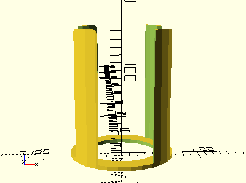
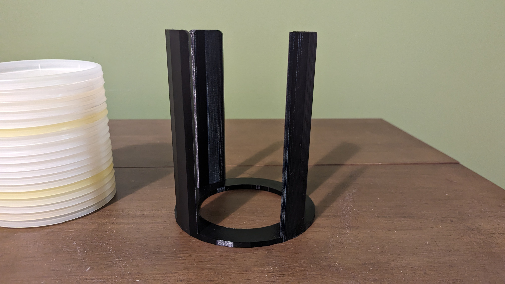
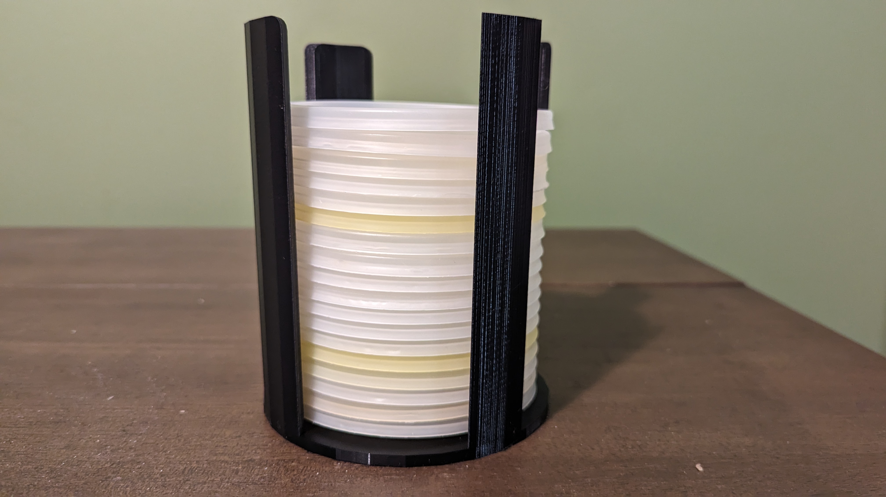

# Soup Container Lid Storage
I designed this to allow me to store the lids for the soup takeout containers that I reuse for food storage. This can be [resized](#resizing) to store any relatively flat circluar object in a neat stack, so long as they do not stick to one another and will not damage one another if they touch. 

## Printing
I printed the listed STL file using 10% infill in PLA, with 0.2mm layer height on a Prusa mks3+. I would not go for lower infill than the 10% I used and I would go higher if being repurposed for anything bigger or heavier than plastic lids, and would not go lower regardless of the usecase.

## Resizing
* `lid_dim`: Diameter of the circle biggest circle that you want to be able to store in mm. Please add the buffer you would like, as the code assumes the actual inner diameter will be the number supplied here
* `thickness`: This is the thickness of each circlar object to be stored in mm, this is used to determine the height of the vertical storage area needed for the requested number of objects to be stored
* `count`: Number of objects to be stored. This is used along with the thickness to determine the required height of the vertical area.
* `mat_thickness`: Thickness of the walls and the base in mm.
* `skirt_mod`: Decimal that the diameter is multiplied by to determine how much of the interior is open. This number must be between 0 and 1. If the number is 0, the base will be solid, if the number is 1 then the base will be only the ring around the outside.